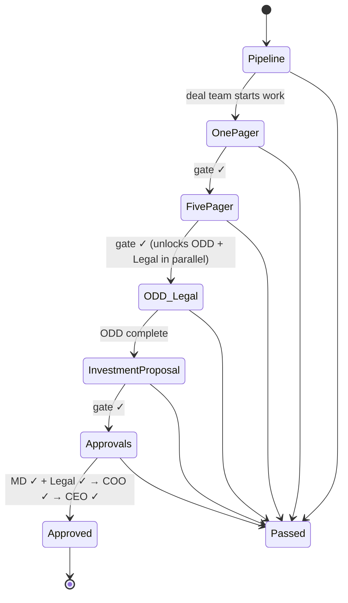

# Investment Process Kanban — Plan

An elegant internal app for managing the manager-allocation investment process: a kanban
board where each card is a prospective allocation moving through a gated workflow, with
documents, follow-ups, role-based approvals, and summary reporting.

---

## 1. Decisions locked in

| Decision | Choice |
|---|---|
| Stack | Next.js (App Router, TypeScript) + Prisma + SQLite, Tailwind CSS. Single deployable process; SQLite swappable for Postgres later. |
| Auth | Roster + roles, no passwords. Admin maintains users; you pick your name to sign in. Roles gate every action; approvals record who clicked. |
| Documents | Uploads **and** links, both versioned per document kind (one-pager v1, v2, …). Files stored on the server under `data/uploads/`. |
| Executive routing | Sequential: MD + Legal (parallel) → COO → CEO. |
| Follow-up gating | **Hard gate**: all follow-ups on a stage must be resolved — or explicitly waived with a note by the deal lead — before the card advances. |
| Reports (v1) | Pipeline by stage × asset class · Approval queue ("waiting on you") · Workload by person. |
| Card fields | Manager name, fund name, asset class (admin-editable list), strategy, target allocation $, deal lead, team members, source/referral, key dates, notes. |

---

## 2. Workflow

Each deal is one card. Columns are major stages; each stage has **exit requirements**
(the gate). The server enforces gates — the UI just explains what's missing.

### Stages and gates

| # | Stage | Who works it | Exit gate (all required) |
|---|---|---|---|
| 1 | **Pipeline** | Deal team | Card fields complete (asset class, lead, target size) |
| 2 | **One-Pager** | Deal team | One-pager document attached · presented-to-team date recorded · all follow-ups resolved/waived |
| 3 | **Five-Pager** | Deal team | Five-pager document attached · presented date recorded · all follow-ups (incl. Q&A items) resolved/waived |
| 4 | **ODD & Legal** | Ops + Legal, in parallel | **ODD track**: background checks done, DDQ reviewed, ODD checklist complete, Ops marks ODD complete. **Legal track** runs alongside but does *not* block exit — it only blocks the Legal approval later. |
| 5 | **Investment Proposal** | Deal team | IP document attached · presented date recorded · follow-ups resolved/waived |
| 6 | **Approvals** | MD, Legal, COO, CEO | See approval chain below |
| ✅ | **Approved** | — | Terminal. Allocation proceeds. |
| ⛔ | **Passed** | — | Terminal, reachable from any stage with a reason note. **On Hold** is a flag (card stays in its column, greyed, excluded from aging). |

### Approval chain (stage 6)

1. **MD approval** — any user with the MD role approves the investment. Available as soon as the card enters Approvals.
2. **Legal approval** — a Legal user approves the docs. Gated on the Legal track being complete: LPA and sub docs attached and the legal checklist done. Runs in parallel with MD.
3. **COO approval** — button appears only after *both* MD and Legal have approved.
4. **CEO approval** — appears only after COO. On CEO approval the card moves to **Approved**.

**Rejection semantics (default, flagged as open question):** any approver can *reject with
a note*, which returns the card to the Investment Proposal stage and voids all approvals
gathered so far; the note becomes a follow-up item. An approver can alternatively
recommend **Pass**, which the deal lead confirms.

Every gate check, transition, approval, waiver, upload, and edit is written to an
append-only audit log on the deal (who, what, when).

---

## 3. Roles & permissions

A user can hold multiple roles (e.g., an MD is also Deal Team).

| Action | Deal Team | Ops | Legal | MD | COO | CEO | Admin |
|---|---|---|---|---|---|---|---|
| Create/edit deal, advance stages | ✓ | | | ✓ | | | ✓ |
| Waive a follow-up (with note) | lead only | | | | | | ✓ |
| Upload deal docs (pagers, IP) | ✓ | | | ✓ | | | ✓ |
| Work ODD checklist, mark ODD complete | | ✓ | | | | | ✓ |
| Upload/manage legal docs, legal checklist | | | ✓ | | | | ✓ |
| Approve: investment | | | | ✓ | | | |
| Approve: legal docs | | | ✓ | | | | |
| Approve: COO / CEO step | | | | | ✓ | ✓ | |
| Manage users, roles, asset classes | | | | | | | ✓ |
| View everything (read-only ok) | ✓ | ✓ | ✓ | ✓ | ✓ | ✓ | ✓ |

---

## 4. Data model (Prisma / SQLite)

- **User** — name, email, roles (join to Role), active flag
- **AssetClass** — name, admin-editable
- **Deal** — managerName, fundName, assetClass→, strategy, targetSizeUsd, lead→User,
  source, stage, status (`active | on_hold | passed | approved`), passedReason, timestamps
- **DealTeamMember** — Deal ↔ User
- **FollowUp** — deal→, stage, track (`deal | odd | legal`), title, assignee→,
  status (`open | resolved | waived`), waiveNote, createdBy→, resolvedAt
- **Document** — deal→, kind (`ONE_PAGER | FIVE_PAGER | DDQ | ODD_REPORT | LPA | SUB_DOCS | IP | OTHER`),
  type (`file | link`), path/url, version (auto-increment per deal+kind), uploadedBy→, note
- **ChecklistItem** — deal→, track (`odd | legal`), label (seeded from admin-editable
  templates: background checks, DDQ review, …), done, doneBy→, doneAt
- **Approval** — deal→, step (`MD | LEGAL | COO | CEO`), status (`pending | approved | rejected`),
  decidedBy→, decidedAt, note
- **StageEvent (audit log)** — deal→, actor→, action, detail JSON, createdAt
- **PresentationRecord** — deal→, stage, presentedAt, notes (feeds the gate)

Gate logic lives in one server module — `lib/workflow.ts` — exposing
`getGateStatus(deal, targetStage)` → list of met/unmet requirements. Both the API
(enforcement) and the UI (explanation) consume the same function, so they can never
disagree.

---

## 5. Screens

1. **Board** — the centerpiece. Seven columns, drag-free (cards advance via the gate
   panel, not free drag — the gate *is* the product). Cards show manager name, asset
   class chip, target size, lead avatar, days-in-stage, and a gate indicator
   (green = ready to advance / amber = items open). Filters: asset class, lead, status.
2. **Deal detail** — header with fields + stage stepper across the top; tabs:
   **Overview** (gate panel front and center), **Documents** (versioned, grouped by kind),
   **Follow-ups**, **ODD**, **Legal**, **Approvals** (the chain with live state),
   **Activity** (audit trail).
3. **Reports** —
   - *Pipeline*: stage × asset class matrix, counts and target-$ totals.
   - *Approval queue*: per-role "waiting on you" list; each signer sees their queue on sign-in.
   - *Workload*: per person — deals led, deals on, open follow-ups/checklist items assigned.
4. **Admin** — users & roles, asset classes, ODD/Legal checklist templates.
5. **Sign-in** — roster picker.

Design language: calm and dense — neutral palette with one accent, generous whitespace,
no dashboards-for-dashboards'-sake. Keyboard-friendly. Everything server-rendered fast.

---

## 6. Milestones

| # | Deliverable |
|---|---|
| **M1** | Scaffold: Next.js + Prisma + Tailwind, schema, roster sign-in, admin (users/asset classes), deal CRUD, board rendering with filters |
| **M2** | Workflow engine: gate module, stage transitions, follow-ups with hard gate + waive, presentation records, audit log |
| **M3** | Documents: upload + link, versioning, kinds; ODD & Legal tracks with checklist templates |
| **M4** | Approval chain end-to-end with sequential routing and rejection flow |
| **M5** | Reports (pipeline, approval queue, workload), on-hold/passed handling, seed data, polish pass, README + Docker |

Each milestone lands as working, committed software — the app is usable from M1 on.

---

## 7. Open questions (defaults chosen, correct me anytime)

1. **Rejection routing** — default: rejection returns the card to Investment Proposal and
   voids prior approvals. OK?
2. **Notifications** — v1 is the in-app "waiting on you" queue; email notifications later?
3. **Currency** — target size in USD only, or multi-currency?
4. **Re-ups** — is a follow-on allocation to an existing manager a new card through the
   full process, or an abbreviated path? (v1: new card, full process.)
